# Intrinsic and Extrinsic Calibration

For an overview of obtaining the intrinsic and extrinsic camera calibration
parameters, generating an AruCo pattern, and constructing the calibration
board, visit the
[UNCC Visionlab wiki](http://visionlab.uncc.edu/dokuwiki/ros_and_camera_calibration).


**Table of Contents**
---------------------

1. [Installation](#Installation)

2. [Dependencies](#Dependencies)

3. [Intrinsic Calibration](#Intrinsic_Calibration)

    A. [Setup](#Launch_setup)

    B. [Calibration](#Execution)

4. [Extrinsic Calibration](#Extrinsic_Calibration)

    A. [Setup](#File_setup)

    B. [Calibration](#Calibration)

    C. [Processing Transform Data](#Processing_Transform_Data)

5. [Aruco Board Advice](#Aruco_Board_Advice)

6. [Running Cableless](#Running_Cableless)

<a name="Installation"/>

## Installation

Once your AruCo pattern is generated, and the board is constructed, install the [`calibrate_mocap_and_camera`](https://github.com/uf-reef-avl/camera_mocap_calibration) package. To do so, create a new workspace or use a catkin_workspace already created and navigate into it:
```
mkdir **name_of_workspace**

cd **name_of_workspace**
```

Create a src directory at the root of this workspace, enter it and clone the remote calibration git repository:

```
mkdir src

cd src

git clone https://github.com/uf-reef-avl/camera_mocap_calibration
```
Then compile it at the root of the workspace:
```
cd ..

catkin_make

```

This package includes other custom packages : ar_sys, rosvrpn, astra_camera_driver, astra_launch_driver and vision_opencv


<a name="Dependencies"/>
## Dependencies
This package depends also upon:
  1. `openni2_launch`
  2. `openni2_camera`
  3. `image_pipeline`

For the Xtion/XBOX-Kinect (kinectv2), two additional packages are required:
  4. `libfreenect2`
  5. `iai_kinect2`

For the AstraPro camera , two additional packages are required:
  6. `libuvc_camera`
  7. `uvc_camera`


For installation on Ubuntu 16.04 LTS using ROS Kinetic, `openni2_launch`, `openni2_camera`,`libuvc_camera`,`uvc_camera` were available through the package manager:

    sudo apt-get install ros-kinetic-openni2-launch ros-kinetic-openni2-camera ros-kinetic-libuvc-camera ros-kinetic-uvc-camera


If you are using the Xtion/XBOX-Kinect, and you are using opencv 3, the package `iai_kinect2` will not compile. You will need to compile against a different version of opencv. This can be accomplished by editing CMAKELists.txt in `kinect2_bridge`. Change:

    find_package(OPENCV REQUIRED)
to

    find_package(OPENCV 2.4.8)

  Moreover the user has to configure his rules.d directory ("/lib/udev/rules.d") to let the application access the USB Port. To achieve this, just copy-paste the files : "55-orbbec-usb.rules" and "56-orbbec-usb.rules" located in the rules folder into the /lib/udev/rules.d directory. Then reboot the laptop to load the new rules.


<a name="Intrinsic_Calibration"/>

## Intrinsic Calibration

Intrinsic calibration refers to the estimation of the parameters intrinsic to the camera that affect the imaging process, such as focal length, image center, image sensor format, distortion, and skew.

<a name="Launch Setup"/>

### Setup

For intrinsic calibration of the RGB camera, run the launch file
**calibrate_rgbd_rgb_cam.launch** from the `calibrate_mocap_and_camera` directory:

      roslaunch calibrate_mocap_and_camera calibrate_rgbd_rgb_cam.launch

For intrinsic calibration of the IR camera, run the launch file
**calibrate_rgbd_ir_cam.launch** from the `calibrate_mocap_and_camera' directory:


      roslaunch calibrate_mocap_and_camera calibrate_rgbd_ir_cam.launch

**Note:**

In the launch files:
* When using the xtion/xbox-kinect camera, make sure that the argument: `driver_openni2` is set to **true** and `driver_astra` is set to **false**.
* When using the astrapro camera, make sure that the argument: `driver_openni2` is set to **false** and `driver_astra` is set to **true**.
* Verify also the `size`'s and `square`'s arguments of the camera calibration node. It should match the chessboard properties. The `size`'s argument is the (number of row - 1) X (number of column - 1) and the `square`'s argument is the length of the side of the pattern in meters.

Only RGB intrinsic calibration needs to be performed for extrinsic calibration.


<a name="Execution"/>

### Calibration

Intrinsic calibration board:

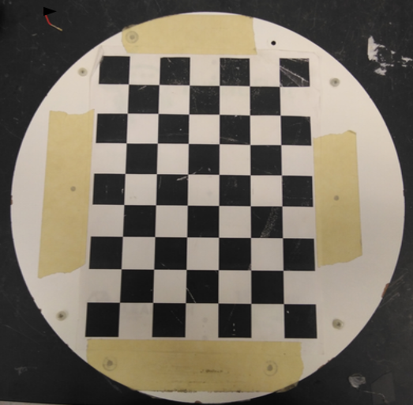


1. Rotate and move the board slowly in the camera's field of view until the progress bars for x, y, skew, and size are green.

    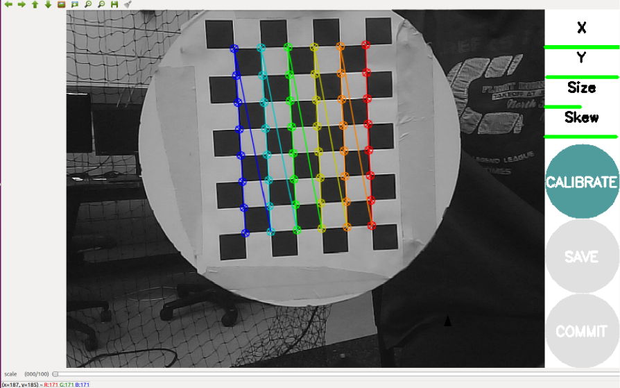

2. Once the bars are filled, the option to generate the intrinsic calibration parameters becomes available. Collecting more sample will improve the accuracy of the intrisinc calibration but oversampling will increase the amount of time for intrinsic calibration computation (250+ samples = 1+ hours).  As the extrinsic calibration depends on the rgb intrinsic calibration, it can also improve the extrinsic results.

3. Click **Calibrate**, and wait for the process to complete. The output terminal should show the intrinsic parameters and the **Save** button should become available.

    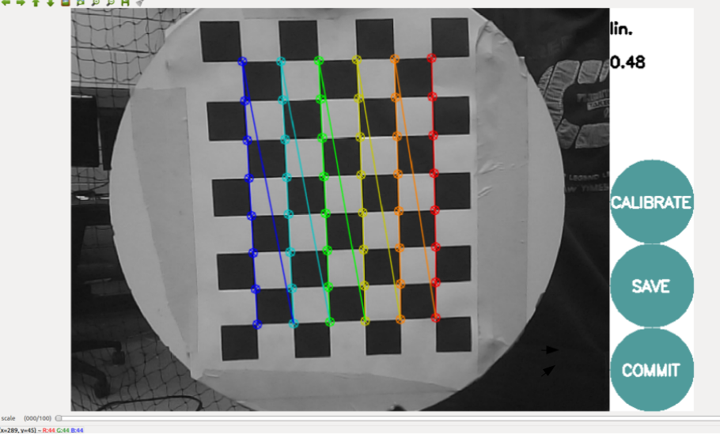

4. Click **Save**, a calibration package (.tar.gz) should be created that contains the images used in calibration as well as the intrinsic parameters in the form of a .yaml file.
5. Click **Commit**, this will save a .yaml file with the intrinsic camera parameters in `~/.ros/camera_info` by default. Check if this file has been correctly generated.

<a name="Extrinsic_Calibration"/>
## Extrinsic Calibration

Extrinsic calibration refers to the estimation of the coordinate system transformations used to relate the world coordinate frame to the camera coordinate frame. Extrinsic parameters will consist of both a translation and rotation matrix.

<a name="File_setup"/>

### Setup

1. Connect the computer that will be running the calibration launch file to **Pathfinder**, and ensure the Motive software is connected with IP **192.168.1.104**.

2. For the extrinsic calibration, two rigid bodies must be created. In motive select the markers of the chosen aruco calibration board (between the big board and the little board as an example), create the rigid body and name it **tf_calib**. Then select the markers which define the camera rigidbody (in this example, it s the quad rigidbody), create the new rigid body and name it **tf_cam**.

      **Warning:** Make sure that the camera's and board's orientation are correctly initialized in Motive (as shown in the images below). The frame must be in NWU.

    Configuration of the quad on the ground and in Motive:

      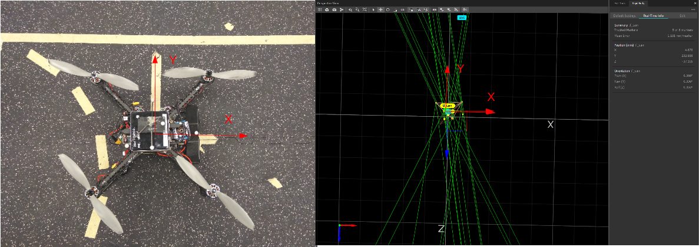

    If used, configuration of the little board on the gound and in Motive:

      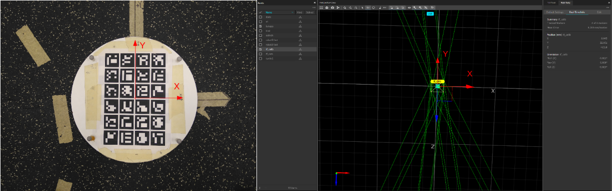

    If used, configuration of the big board on the gound and in Motive:

      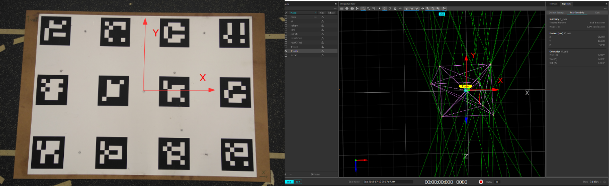

    If you want to reset the rigidbody orientation because yaw, pitch and roll aren't set to 0 degrees in the rigidbody's panel (Real Time Info tab):

    -Select the rigidbody and click on the edit button

      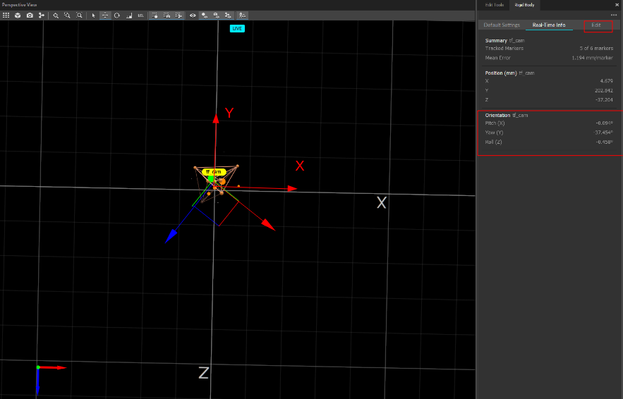

    -Then click on the reset button in the orientation panel. It is also possible to change the position of the rigidbody's centroid in the pivot point panel.

      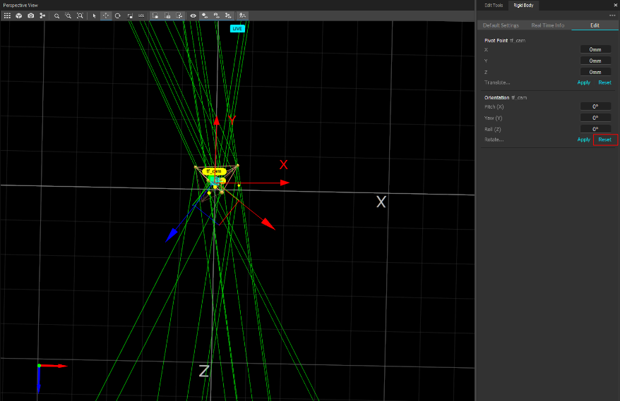

    -Finally, yaw, pitch and roll will be set to zero.

      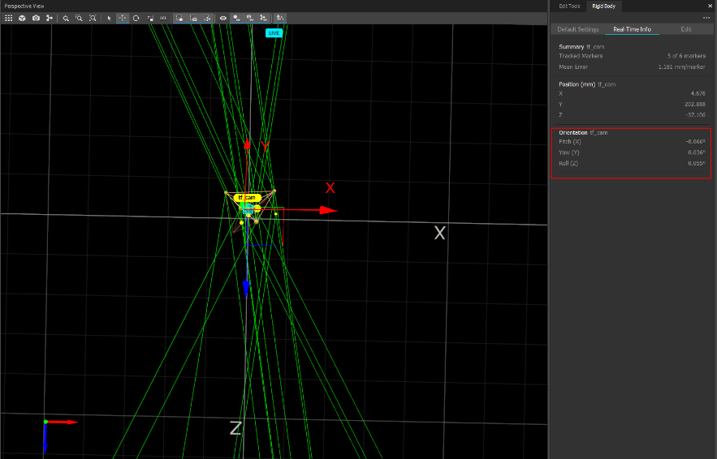

3. Once the rigidbodies are created and initialized properly, modify the arguments in the launch file **board_moves_w_truth.launch** ("./launch/extrinsic") to make the calibration work with the current configuration:
  * `calibration_data_filename` must point to the file where you would like to store the calibration transform results.
  * choose the right driver argument between: `driver_usb_cam`, `driver_cv_camera`, `driver_openni2`, `driver_astra`,`driver_astra_pro`, set it to  **true** according to the camera currently used and set the others ones to **false**.
  * check the path defined by the `camera_info` argument points to the intrinsic .yaml camera parameters in the **~/.ros/camera_info** directory
  * change the `board_config` argument to point to the right board configuration file. Depending on the board chosen, modify also the `marker_size` argument:
	   * the **pose_calib_00.yml** ("./data/single") correspond to the little board with `marker_size` = 0.035 meters
       * the **pose_calib_01.yml** ("./data/single") correspond to the big board with `marker_size` = 0.2032 meters
4. Then run the launch file **board_moves_w_truth.launch** from the package `calibrate_mocap_and_camera`.

```
roslaunch calibrate_mocap_and_camera board_moves_w_truth.launch
```
<a name="Calibration"/>

### Calibration

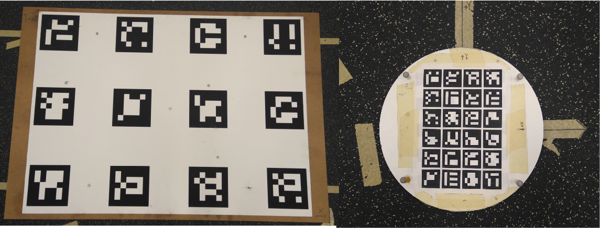

1. Orient the chosen aruco board as shown on the images above in order to face the center of the camera's field of vision.

2. Leave the board stationary, and slowly move the camera.

3. Be sure to exercise all degrees of orientation and position while keeping the majority of the Aruco marker in view.

4. Calibration should take ~1-3 minutes. When ample data has been captured, kill the node ("ctrl-c").


<a name="Processing_Transform_Data"/>

### Processing Transform Data

The transform data must have outliers/discontinuities removed before being used to calculate extrinsic parameters. This data will be plotted and outliers removed.
Run the python script **calibout_running_median_filter.py** (python3 calibout_running_median_filter.py located in the post-processing directory) to remove these discontinuities thanks to a median filter. Generally use the **all** option with a median window of 20 and then use the option *save*. The user can interact with theses scripts through the terminal. In order to perform this, ensure Python3, pip3 and matplotlib are installed :

        sudo apt-get install python3-pip
        pip3 install matplotlib numpy scipy
        sudo apt-get install python3-tk

**Notes**
This python script process the result file named **calib_transforms.txt** and located in the home directory. Ensure that your extrinsic result file has this name and is located in the home directory.   

The resulting files will be named **extrinsec_parameter_ned.yaml** for the NED frame and **extrinsec_parameter_ned.yaml** for the NWU frame and will be located in the home directory. 

## Aruco Board Advice

The aruco board can be created thanks to the tutorial on the website [UNCC Visionlab wiki](http://visionlab.uncc.edu/dokuwiki/ros_and_camera_calibration). But if you have already an aruko board and do not have the corresponding yaml file, you will have to create this file manually.


1. First of all, you will have to recognize the aruco markers ID on the board. It is possible by using the **ar_sys** node and by checking the pattern image and orientation with the online  [Marker generator](http://terpconnect.umd.edu/~jwelsh12/enes100/markergen.html)

2. From scrath create a file with the extension ".yaml", add the lines below and modify the value of the *aruco_bc_nmarkers* and *aruco_bc_mInfoType* depending of your board:

        %YAML:1.0
        aruco_bc_nmarkers: 24 # this number specify the number of marker of your aruco board
        aruco_bc_mInfoType: 0 # indicates if the data in MakersInfo is expressed in meters (value = 1) or in pixels (value = 0)  so as to do conversion internally
        aruco_bc_markers:

3. The origin of the coordinate system of the aruco board is the point at the center of the calibration pattern. The Z axis is perpendicular to the calibration board plane, the X axis is across the columns and the Y axis is across rows. Each aruco marker must be define as below:

       - { id: "ID of the aruco marker", corners:[ [ x top left corner,  y top left corner, 0. ], [ x top right corner, y top right corner, 0. ], [
       x bottom right corner, y bottom right corner, 0. ], [ x bottom left corner, y bottom left corner, 0. ] ] }

When the **aruco_bc_mInfoType** argument is set to pixel (value = 0), every side's length of an aruco marker is 100 and all the others distance are defined proportionaly to this side's length.  Then the coordinate of each aruco marker's corner can be computed as follow:

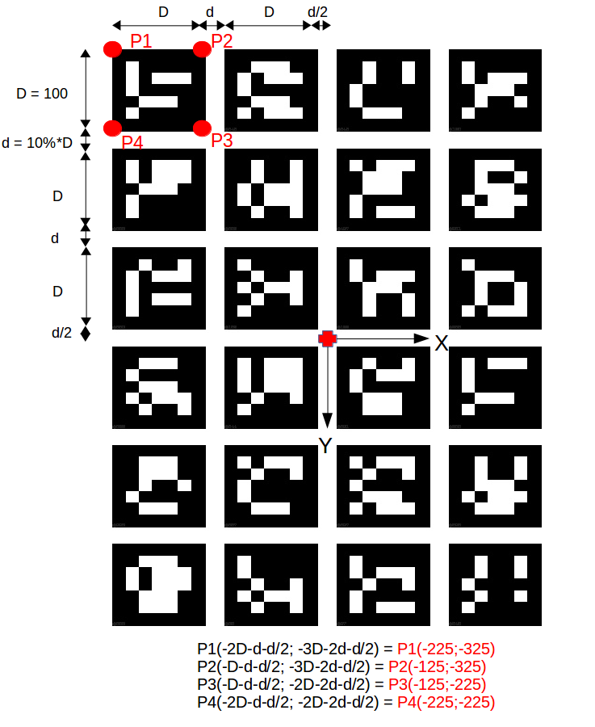

As the yaml file is a dictionary, the order of definition of the aruco markers doesn't really matter but ensure that all the aruco markers have been defined in the yaml file.

<a name="Running_Cableless"/>

## Running Cableless

The following steps explains how to perform the Extrinsic calibration without being plugged into a monitor. This assumes you are using an onboard computer like a NUC or Ordoird etc...
1) Identify the IP address of your onboard computer and a laptop which has ROS 
2) Clone and build the package on both the onboard computer and laptop.
3) Open the .bashrc file on the onboard computer and enter the following commands:

    export ROS_MASTER_URI=http://[IP OF ONBOARD COMPUTER]:11311

4) source ~/.bashrc
5) Now make the same changes to your .bashrc file on your laptop ie 

    export ROS_MASTER_URI=http://[IP OF ONBOARD COMPUTER]:11311
    
6) Set the "run_rviz" flag to false on the onboard computer and launch the extensic calibration (via ssh)
7) Over on your laptop, launch the "run_rviz.launch" file.
